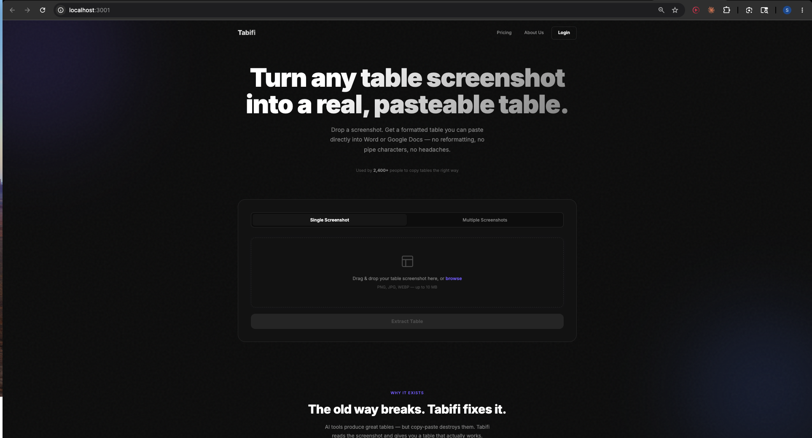
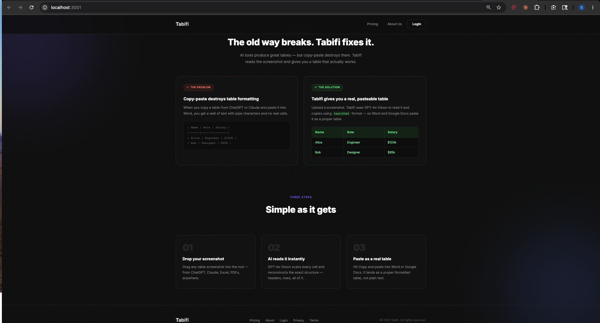
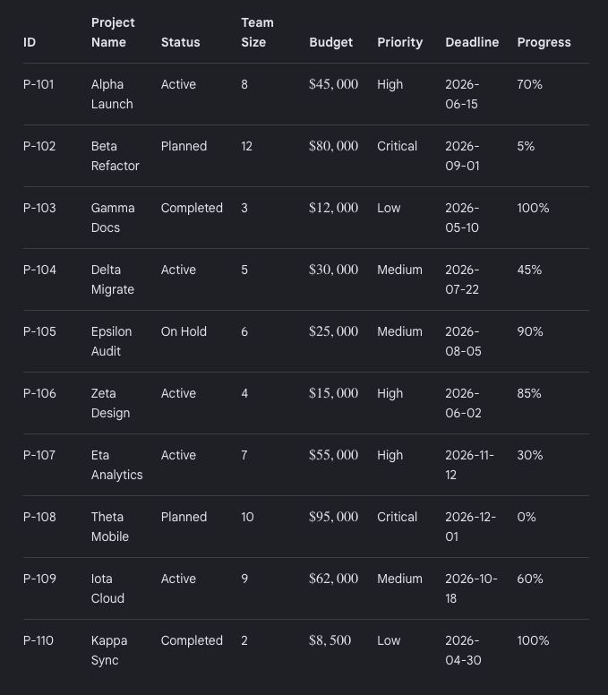
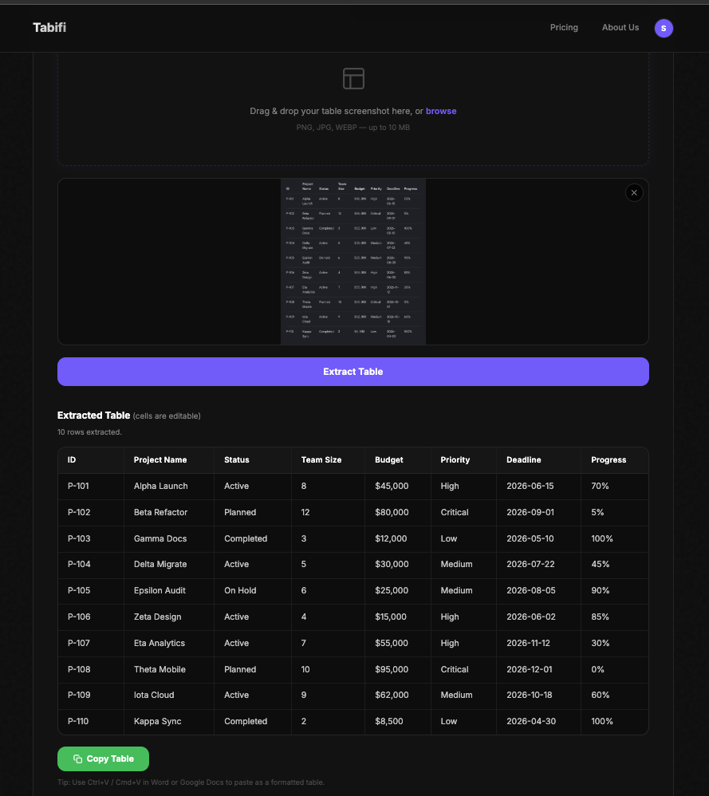
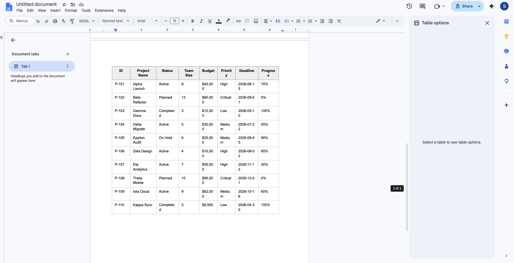

# Tabifi — Screenshot to Table, Instantly

Upload a screenshot of any table and get a real, editable table you can paste directly into Word or Google Docs — with full formatting intact.

---

## The App



---

## The Problem It Solves

When AI tools (ChatGPT, Claude) generate tables, copying and pasting them into Word or Google Docs destroys the formatting — you get a wall of pipe characters instead of real cells. Tabifi fixes this by reading the table from a screenshot using GPT-4o Vision and copying it as `text/html`, so it pastes as a proper formatted table.



---

## How It Works

### Step 1 — Drop your table screenshot

Any table from anywhere — ChatGPT, Claude, Excel, a PDF, a dashboard.



### Step 2 — Tabifi extracts the table using AI

GPT-4o Vision reads every cell and reconstructs the exact structure. Cells are editable before you copy.



### Step 3 — Paste as a real table in Google Docs or Word

Hit **Copy Table** and paste. It lands as a proper formatted table with real cells — not plain text.



---

## Features

- **Single screenshot mode** — upload one image, extract the table instantly
- **Multi-screenshot stitching** — upload 2–10 screenshots of the same table, drag to reorder, merge into one combined table
- **Editable cells** — fix any OCR mistakes before copying
- **One-click copy** — copies as `text/html` so it pastes as a real table in Word, Google Docs, Notion, and more
- **Auth system** — Google OAuth login with session management
- **Progress tracking** — per-image status badges and progress bar for multi-mode

---

## Tech Stack

| Layer | Technology |
|---|---|
| Backend | Node.js + Express |
| Frontend | Vanilla HTML/CSS/JavaScript |
| AI | OpenAI GPT-4o Vision API |
| Auth | Google OAuth 2.0 |
| File uploads | multer |
| Animations | GSAP + ScrollTrigger |

---

## Setup

**1. Clone the repo**
```bash
git clone https://github.com/shilp-tech/copy_the_table.git
cd copy_the_table
```

**2. Install dependencies**
```bash
npm install
```

**3. Add your credentials**
```bash
cp .env.example .env
# Fill in OPENAI_API_KEY, GOOGLE_CLIENT_ID, SESSION_SECRET
```

**4. Start the server**
```bash
node server.js
```

**5. Open in browser**
```
http://localhost:3000
```

---

## The Core Trick

```js
navigator.clipboard.write([
  new ClipboardItem({
    "text/html":  new Blob([html],  { type: "text/html" }),
    "text/plain": new Blob([tsv],   { type: "text/plain" }),
  })
])
```

Copying with `text/html` stores actual HTML in the OS clipboard. Word and Google Docs both read this format on paste, reconstructing the table with real cells instead of plain text.

---

## Author

**Shilp Patel** — Masters in Advanced Data Analytics, University of North Texas
